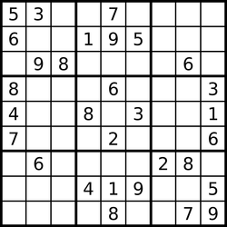
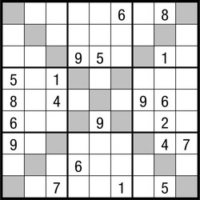

# Homework 01: Sudoku

**Publication date:** 8th October

**Submission deadline:** 26th October 23:59

## General information

The goal of this assignment is to write an implementation of _Sudoku_ game.

The maximum number of points for this assignment is **7**.

- **4 points** for passing tests (attached tests do not guarantee a 100% correctness).
- **2 points** for correct implementation (evaluated by your class teacher).
- **1 points** for clean and elegant implementation (code conventions, minimal code repetition).

In cases **when provided tests do not pass** with submitted solution you can be granted no more than **4 points** 
(this means that you can be granted **0 points** as well)! Don't forget to check the checkstyle with command

```bash
 mvn clean install -Dcheckstyle.fail=true
```

## Existing classes

- [Javadoc of all classes](https://www.fi.muni.cz/~xsabo4/2018-pb162-hw01/javadoc/overview-tree.html).
  * Read **all** the documentation (mostly interfaces & helpers) **carefully**!
  * Don't forget to check the _Method Detail_ section.
- Interface `Cell` represents Sudoku cells.
- Abstract class `InfiniteCellSequence` adds methods to create an infinite sequence.
- You can use classes in package _helper_, especially `ArrayUtils` and `SudokuChecker` can be handy.

## Implementation

Package  ```cz.muni.fi.pb162.hw01.impl``` should contain your implementation.
Anything outside this package will be ignored during the evaluation.

### LetterCell

Extends [InfiniteCellSequence abstract class](https://www.fi.muni.cz/~xsabo4/2018-pb162-hw01/javadoc/cz/muni/fi/pb162/hw01/InfiniteCellSequence.html).

- constructor `LetterCell(char value)`
- `startingValue()` is `'A'`
- `nextValue()`
  * for A returns B
  * for B returns C
  * etc.
  * the next value is `ordinalValue + 1`
- `getValue()` of `'A'` is `"A"`

### NumberCell

Extends [InfiniteCellSequence abstract class](https://www.fi.muni.cz/~xsabo4/2018-pb162-hw01/javadoc/cz/muni/fi/pb162/hw01/InfiniteCellSequence.html).

- constructor `NumberCell(int value)`
- `startingValue()` is `1`
- `nextValue()`
  * for 1 returns 2
  * for 2 returns 3
  * etc.
- `getValue()` of `1` is `"1"`

### BasicSudoku

Implements [Sudoku interface](https://www.fi.muni.cz/~xsabo4/2018-pb162-hw01/javadoc/cz/muni/fi/pb162/hw01/Sudoku.html).

Constructor has two arguments:
  * 2D board of cell values including nulls,
  * array of available elements in an ascending order (= possible values).



### DiagonalSudoku

Implements [Sudoku interface](https://www.fi.muni.cz/~xsabo4/2018-pb162-hw01/javadoc/cz/muni/fi/pb162/hw01/Sudoku.html).

In addition to unique row, column and block, the two main diagonals also have to be unique.

Constructor is the same as in _BasicSudoku_.



### DiagonalSudokuChecker

Checks additional diagonal rule, similar to `SudokuChecker`.

Create your custom checker logic, you can use the following guidelines (or implement it the other way):

- constructor `DiagonalSudokuChecker(Sudoku sudoku)`
- `boolean isDiagonal1(int column, int row)`
  * returns `true` if index is on diagonal1
  *  similarly `isDiagonal2`
- `Cell[] diagonal1Cells()`
  * returns diagonal cells in an array
  *  similarly `diagonal2Cells`
- `boolean isDiagonal1Valid(int column, int row, Cell c)`
  * checks whether cell insertion is valid (checking diagonal1)
  *  similarly `isDiagonal2Valid`

### SudokuBuilder

This class represents the builder pattern (which is, for instance, used in `StringBuilder`).

The main reason to create this class is to make Sudoku creation easier.

All methods (except constructor) return reference to current object.

- constructor `SudokuBuilder(int size, InfiniteCellSequence cellType)`
  * sudoku has `size` x `size` dimensions
  * its elements are first `size` values of `InfiniteCellSequence`
- `SudokuBuilder cell(int column, int row, Cell c)`
  * puts cell c into \[column, row\]
- `SudokuBuilder diagonal(boolean isDiagonal)`
  * `isDiagonal` represents if the diagonal rule is applied on sudoku
  * in other words, if the `BasicSudoku` or `DiagonalSudoku` instance
    is created when Sudoku is build
- `Sudoku build()`
  * creates and returns Sudoku with given cells and properties

If no cells are set, all cells have value (`null`).

If no `diagonal` property is set, the basic sudoku will be created.

If multiple contradicting actions are used,
f.e. `.diagonal(true).diagonal(false)`
then only the last one of the colliding actions is valid.

You can expect the sudoku will consist of elements of exactly one type, which is defined in the constructor.

```java
public final class SudokuSample {
  public static Sudoku createSmallDiagonalLetterSudoku() {
      return new SudokuBuilder(4, LETTER_TYPE)
                .cell(0, 0, new LetterCell('A'))
                .cell(3, 0, new LetterCell('B'))
                .cell(3, 1, new LetterCell('C'))
                .cell(1, 2, new LetterCell('D'))
                .diagonal(true)
                .build();
  }
  // ...
}
```

The result:

```text
|=====|=====|
| A _ | _ B |
| _ _ | _ C |
|=====|=====|
| _ D | _ _ |
| _ _ | _ _ |
|=====|=====|
```

### Demo

To check your solution, try `Demo`, because **some things are not checked in public tests**.

There are three sudoku example, you can change them easily -- see `Demo` class.

To see available commands, type _help_.

### Notes

Validation is not needed unless specified. You don't need to:
- check for `null` input
- check for out of range indexes
- make defensive copies (f.e. copy an array)
